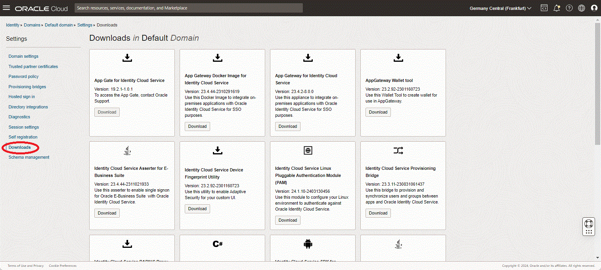
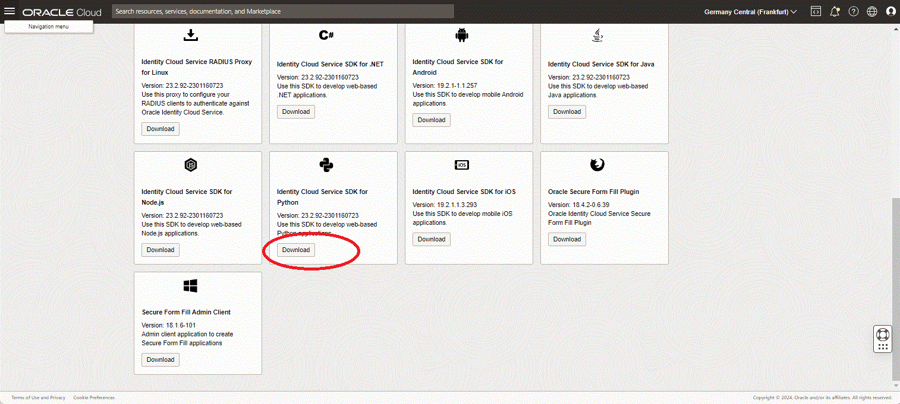

# Pyhton Example of Python app with OCI IAM Domainas Identity Provider  

Author: Inge Os

The aim is to show how you may configure SSO between an Pyhton app an instance of  Oracle OCI IAM Domain,
using the OCI IAM SDL for python.

The example builds on an earlier Oracle By Example post, and the download of the python SDK from an OCI IAM Domain.

The example has been updated to Python 3.0 and jwt 2.x.
The downloaded code of the SDK from a OCI IAM Domain is based on deprectiated features  of JWT.

You may use the [Use Oracle Identity Cloud Service's Software Development Kit (SDK) for Authentication in Python Web Applications](https://www.oracle.com/webfolder/technetwork/tutorials/obe/cloud/idcs/idcs_python_sdk_obe/idcs-python-sdk.html) as more complete instructions, but note the changes below.

A PDF version of the lab.

Also consult the README.md in the git repo of the sample app  
  
##  Requirements

Python 3.x
sqlite 3.xxx or above
pip upgraded to latest version
rust
python setuptool_rust   ```pip install setuptool_rust```

In the text below the following environment variables are used:
- ```$SDK_HOME=/home/idssdk/iam-sdk```
- ```$APP_HOME=/home/idcsapp```
- ```$PYTHON_VENV_HOME=/home/idcssdk/py38```


## PRepare the envrionment, and download the SDK and the SDK Application 

- Install Python 3.x and create a virtual environment
- Enable your virtual environment
- Download or clone the git repo https://github.com/oracle-samples/idm-samples/
- Copy all files under https://github.com/oracle-samples/idm-samples/tree/master/idcs-sdk-sample-apps/python or your local clone to a local app directory

The structure chould look like:
```
(py36) [idcssdk@iosjumpv3 iam-sample-app]$ find -O1 .
.
./config.json
./db.sqlite3
./LICENSE.md
./manage.py
./python
./python/__init__.py
./python/settings.py
./python/urls.py
./python/wsgi.py
./README.md
./sampleapp
./sampleapp/__init__.py
./sampleapp/admin.py
./sampleapp/apps.py
./sampleapp/migrations
./sampleapp/migrations/__init__.py
./sampleapp/migrations/__pycache__
./sampleapp/migrations/__pycache__/__init__.cpython-36.pyc
./sampleapp/models.py
./sampleapp/static
./sampleapp/static/css
./sampleapp/static/css/sample-app.css
./sampleapp/static/font
./sampleapp/static/font/UniversLTStd-Ex.ttf
./sampleapp/static/font/good times rg.ttf
./sampleapp/static/images
./sampleapp/static/images/oracle.gif
./sampleapp/static/images/oracle.jpg
./sampleapp/templates
./sampleapp/templates/sampleapp
./sampleapp/templates/sampleapp/about.html
./sampleapp/templates/sampleapp/home.html
./sampleapp/templates/sampleapp/includes
./sampleapp/templates/sampleapp/includes/leftmenu.html
./sampleapp/templates/sampleapp/includes/publicheader.html
./sampleapp/templates/sampleapp/index.html
./sampleapp/templates/sampleapp/login.html
./sampleapp/templates/sampleapp/myProfile.html
./sampleapp/tests.py
./sampleapp/urls.py
./sampleapp/views.py
./solution
./solution/.DS_Store
./solution/python_sdk_sample_app.zip
./THIRD_PARTY_LICENSES.txt
```

## Download SDK and python application  

- From the lab above Step 1, download the SDK from the OCI IAM Domain

Navigation to the download pages in your OCI IAM Domain

 

  

  

Unzip the downloaded SDK, and save it, in this example to a iam-sdk folder:  

```(py36) [idcssdk@iosjumpv3 iam-sdk]$ unzip /usr/tmp/python-23.2.92-2301160723.zip
Archive:  /usr/tmp/python-23.2.92-2301160723.zip
  inflating: requirements.txt
   creating: src/
  inflating: src/IdcsClient.py
  inflating: src/Constants.py
  inflating: .devops_metadata.json
  inflating: README.txt
  inflating: FileInfo.json
```

## Create a confidential application in your OCI IAM Domain

The screens are changed from IDCS look&feel to OCI IAM look and feel, but the funtionality is exactly the same.  
The only difference is that, despite you may check the box, OCI IAM Domains will require HTTPS

The simple python app is configured with http, it is recommended to use the OCI LoadBalancer as termination point for TLS.

Navigate to your OCI IAM Domain, and select integrated applications  

[files/iam1.jpg](files/iam1.jpg)

Select create application and select create confidential application

[files/iam2.jpg](files/iam2.jpg)

Fill inn name, leave the others 

[files/iam3.jpg](files/iam1.jpg)

Select configure oauth  

[files/iam1.jpg](files/iam1.jpg)

tick off Authorization Code and Client Credentials

[files/iam4.jpg](files/iam4.jpg)

The check box allow HTTP has no effect, HTTPS is mandatory

[files/iam5.jpg](files/iam5.jpg)

Enter redirect ULR (user server/callback) and Post-logout redirect 

[files/iam6.jpg](files/iam6.jpg)

Keep the client-id and client-secret. They will be required in the client app configuration

[files/iam7.jpg](files/iam7.jpg)

Activate the application

[files/iam8.jpg](files/iam8.jpg)

## Prepare the python envrionment

Activate tyhe Python 3.x virtual envrionment previously created, and then add all the required python packages.
Naviagte to the directory with teh unzipped version of the python SDK, and edit the file requirements.txt and remove all hard version dependencies.
(These are Python 2.x spesific) as follows:
Change from:
```
requests==2.21.0
six==1.12.0
simplejson==3.16.0
PyJWT==2.4.0
lru-ttl==0.0.7
cryptography==3.3.2
```
to:
```
requests
six
simplejson
PyJWT
lru-ttl
cryptography
```
Install the requirements with ```pip install -r requirements.txt``` 
Please note ```setuptools_rust``` needs to be installed pripr to installing the requirements

 ## Prepare Application

 Navigate to the directory where teh python app is unpacked
 Clone this repo or download the files as follows:
 - [files/Constants.py](files/Constants.py) to two locations, ```$APP_HOME/.``` and ```$APP_HOME/sampleapp/.```
 - [files/IdcsClient.py](files/IdcsClient.py) to ```$APP_HOME/sampleapp/.```
 - [files/views.py](files/views.py) to ```$APP_HOME/sampleapp/.```

 Finally, if the version of sqlite installed is below the required version, you may either upgrade sqlite or patch the file  

 ```$PYTHON_VENV_HOME/lib64/python3.6/site-packages/django/db/backends/sqlite3/base.py``` line 66  

 ```if Database.sqlite_version_info < (3, 9, 0):``` to the sqlite3 version you have installed  

## Update the application 

Edit $APP_HOME/config.json, and fill inn the clientid, client secret from the confidential application created above, and add in the URL to the OCI IAM Domain.

```
  cat config.json
{
  "ClientId" : "8caf8caf8caf8caf8caf8caf8caf",
  "ClientSecret" : "d11fb-d11fb--d11fb-d11fb-d11fb",
  "BaseUrl" : "https://idcs-myociiamservice.identity.oraclecloud.com",
  "AudienceServiceUrl" : "https://idcs-myociiamservice.identity.oraclecloud.com",
  "scope" : "urn:opc:idm:t.user.me openid",
  "TokenIssuer" : "https://identity.oraclecloud.com/",
  "redirectURL": "http://localhost:8000/callback",
  "logoutSufix":"/oauth2/v1/userlogout",
  "LogLevel":"INFO",
  "ConsoleLog":"True"
}
```

 ## Initial run of the application

Initially the application requre a migration step:
```
cd $APP_HOME
python manage.py migrate
```
 ## Startup of the application

 ```
cd $APP_HOME
python manage.py run server
```
Output from the start command
```
 python manage.py runserver 10.10.0.144:8080
Watching for file changes with StatReloader
Performing system checks...

System check identified no issues (0 silenced).
October 07, 2024 - 19:24:54
Django version 3.2.25, using settings 'python.settings'
Starting development server at http://10.10.0.144:8080/
Quit the server with CONTROL-C.
```

View the serveroutput fromthe test server, demonstrates the callback from the OCI IAM Domain 
   
[files/serveroutput.jpg](files/serveroutput.jpg)

 ## Test through the browser

Start the application

[files/browser1.jpg](files/browser1.jpg)  
  
Select login
[files/browser2.jpg](files/browser2.jpg)  
  
Redirected to OCI IAM Domain as IDP
[files/browser3.jpg](files/browser3.jpg)  
  
Logged on, select my profile
[files/browser4.jpg](files/browser4.jpg)  
  
Profile information 
[files/pytest5.jpg](files/pytest5.jpg)  
  

# Documentation Links

Oracle OCI IAM Domain, license types
[](https://docs.oracle.com/en-us/iaas/Content/Identity/sku/overview.htm)  
  
Use Oracle Identity Cloud Service's Software Development Kit (SDK) for Authentication in Python Web Applications,
original article
[](https://www.oracle.com/webfolder/technetwork/tutorials/obe/cloud/idcs/idcs_python_sdk_obe/idcs-python-sdk.html)


# License

Copyright (c) 2024 Oracle and/or its affiliates.

Licensed under the Universal Permissive License (UPL), Version 1.0.
